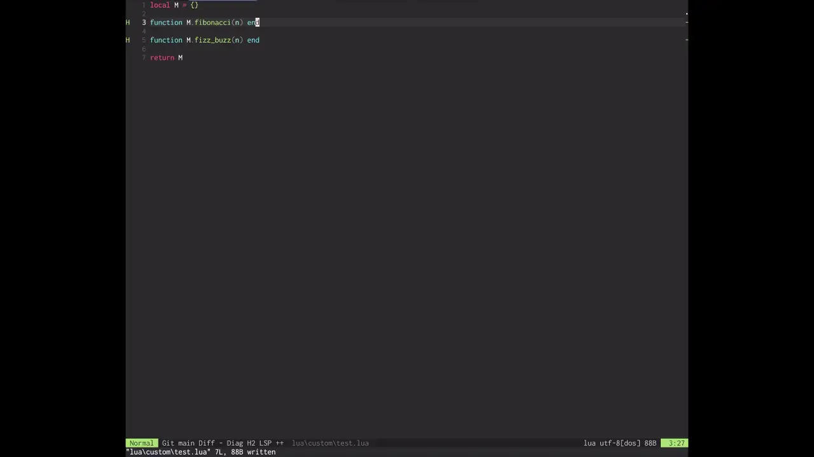

# inliner

A Neovim plugin for AI-powered inline code editing with support for multiple LLM providers (OpenAI, Anthropic, xAI, GitHub Copilot, OpenRouter, Cerebras, Gemini).

Select code, press a keybinding, and the AI edits it inline - no confirmation dialogs.

<div align="center">
  <div style="display: inline-block; padding: 3px; border-radius: 20px; background: linear-gradient(135deg, #667eea 0%, #764ba2 50%, #f093fb 100%); box-shadow: 0 8px 32px rgba(102, 126, 234, 0.3);">
    <div style="display: inline-block; padding: 3px; border-radius: 17px; background: linear-gradient(180deg, rgba(255,255,255,0.1) 0%, transparent 100%);">
      <div style="background: #0d1117; border-radius: 15px; padding: 8px;">
        
      </div>
    </div>
  </div>
  <br>
  <sub><samp>Select → Describe → AI rewrites inline</samp></sub>
</div>

## Features

- **AI Edit** (`<leader>ae`) - select code, describe the change, AI rewrites it inline
- **AI Question** (`<leader>aq`) - ask questions about your code in a chat window
- **AI Explain** (`<leader>ax`) - get an explanation of selected code in a chat window
- **Diff mode** - review AI changes as git-style conflict markers before applying
- Customizable system prompts, provider, model, and keybindings
- Multi-turn chat in a floating window
- Built with Lua for optimal performance

## Prerequisites

- Neovim >= 0.9.0
- API key for at least one supported provider

## Installation

### lazy.nvim

```lua
{
  "inliner",
  event = "VeryLazy",
  opts = {},
}
```

### packer.nvim

```lua
use {
  "inliner",
  config = function()
    require("inliner").setup()
  end,
}
```

## Quick Start

1. Set your API key(s) in your shell profile:
   ```bash
   export OPENAI_API_KEY="your-openai-api-key"
   export ANTHROPIC_API_KEY="your-anthropic-api-key"
   export XAI_API_KEY="your-xai-api-key"
   export OPENROUTER_API_KEY="your-openrouter-api-key"
   export CEREBRAS_API_KEY="your-cerebras-api-key"
   export GEMINI_API_KEY="your-gemini-api-key"
   ```
   For GitHub Copilot, the token is read automatically from Copilot's `apps.json` - no manual env var needed.

2. Select code in visual mode (`v`, `V`, or `Ctrl-v`) and press:
   - `<leader>ae` to edit with AI
   - `<leader>aq` to ask a question
   - `<leader>ax` to get an explanation

3. Enter your instruction and the AI responds inline or in a chat window.

Run `:checkhealth inliner` to verify your setup is ready.

## Keybindings

The following default keybindings are registered when `setup()` is called:

| Key          | Mode | Action                    |
|--------------|------|---------------------------|
| `<leader>ae` | n, v | Edit current line or selection with AI |
| `<leader>aq` | n, v | Ask a question about code |
| `<leader>ax` | n, v | Explain selected code     |

All keybindings are configurable via the `keys` option.

## Commands

| Command              | Description                                      |
|----------------------|--------------------------------------------------|
| `:InlinerEdit`       | Edit the current line or visual selection with AI |
| `:InlinerQuestion`   | Open the question/chat window                    |
| `:InlinerExplain`    | Open a chat with an explanation of selected code |

## Configuration

### Provider and Model

```lua
require("inliner").setup({
  llm = {
    provider = "openai",        -- "openai", "anthropic", "xai", "copilot", "openrouter", "cerebras", "gemini"
    model = "gpt-4o-mini",      -- Model name (optional - provider default used if nil)
  },
})
```

### Diff Mode

When enabled, AI edits are presented as git-style conflict markers instead of being applied directly. Use the conflict resolution keybindings to accept or reject changes.

```lua
require("inliner").setup({
  diff_mode = true,
})
```

Default conflict resolution keymaps:

| Key  | Action                              |
|------|-------------------------------------|
| `co` | Accept current (original) version   |
| `ct` | Accept incoming (AI) version        |
| `cb` | Accept both versions                |
| `]x` | Jump to next conflict               |
| `[x` | Jump to previous conflict           |

### Question / Chat

Open a floating chat window to ask questions about your code. Supports multi-turn conversations.

```lua
require("inliner").setup({
  question = {
    system_prompt = "Your custom system prompt",  -- optional, uses default if nil
    input = { prompt = "Questions: " },
    max_width = 80,
  },
})
```

### Context Lines

Controls how many lines of surrounding context are sent to the LLM alongside the selection.

```lua
require("inliner").setup({
  context_lines = {
    before = 20,    -- lines above the selection
    after = 10,     -- lines below the selection
  },
})
```

### All Options

```lua
{
  system_prompt = string,                    -- Custom system prompt for AI Edit
  keys = {                                   -- Array of keybinding specs (see Keybindings)
    { "<leader>ae", handler, mode = "n", desc = "AI Edit Line" },
    { "<leader>ae", handler, mode = "v", desc = "AI Edit Selection" },
    { "<leader>aq", handler, mode = "n", desc = "AI Question" },
    { "<leader>aq", handler, mode = "v", desc = "AI Question Selection" },
    { "<leader>ax", handler, mode = "n", desc = "AI Explain Line" },
    { "<leader>ax", handler, mode = "v", desc = "AI Explain Selection" },
  },
  llm = {
    provider = "openai",                     -- Provider to use
    model = nil,                             -- Model name (optional)
    timeout = 30000,                         -- Request timeout in ms
    base_url = nil,                          -- Custom API endpoint (optional)
    max_output_tokens = nil,                 -- Max tokens in response (optional)
  },
  input = {
    prompt = "AI Edit: ",
    icon = "󱚣",
    win = { title_pos = "left", relative = "cursor", row = -3, col = 0 },
  },
  question = {
    system_prompt = nil,                     -- Custom system prompt for Question mode
    input = { prompt = "Questions: " },
    max_width = 80,
  },
  context_lines = {
    before = 20,
    after = 10,
  },
  diff_mode = false,
  diff = {
    autojump = true,                         -- Auto-jump to next conflict after resolving
    mappings = { ours = "co", theirs = "ct", both = "cb", next = "]x", prev = "[x" },
    highlights = { current = "DiffText", incoming = "DiffAdd" },
  },
  debug = false,
  log_file = vim.fn.stdpath("state") .. "/inliner.log",
  debug_max_log_size = 5000,                 -- Truncate log content longer than this
}
```

## Development

Tests use [plenary.nvim](https://github.com/nvim-lua/plenary.nvim). The test runner clones it automatically if not present.

```bash
make test          # Run tests
make format        # Format Lua files (stylua)
make format-lua    # Format Lua files only
make lint          # Lint Lua files (stylua + luacheck)
make lint-lua      # Lint Lua files only
```

## License

[MIT](LICENSE)
